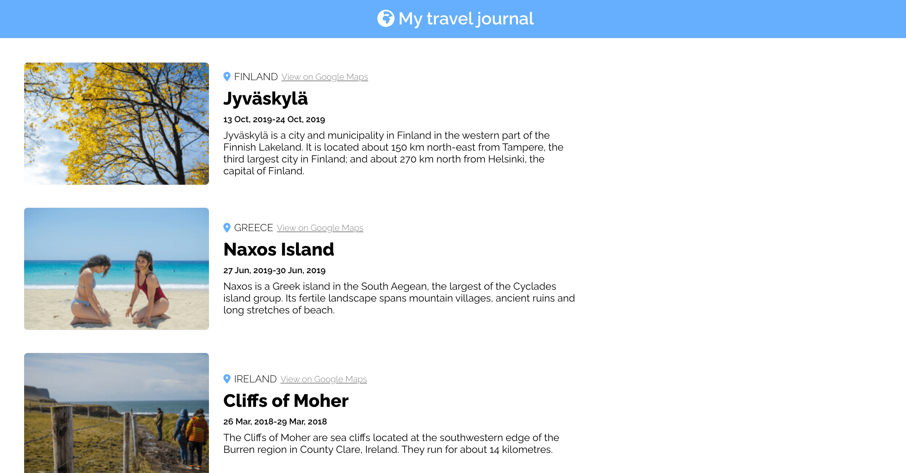

  

 

<h3 align="center">A personal travel journal written in React</h3>

<h3 align="center"><a href="https://margos-travel-journal.netlify.app/">Try me!</a></h3>

## Technologies Used

&nbsp;&nbsp;&nbsp;&nbsp;&nbsp;&nbsp;

## Description

The application fetches data from a static dataset, and generates a set of card elements using props, as well as conditional rendering. Each card element contains a travel destination with various data about it.

 

## Screenshots

## nice chance to get job sss
